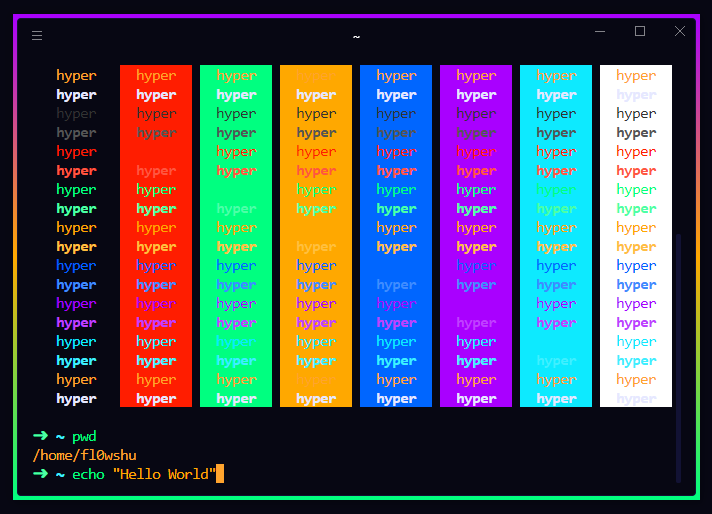

## hyper-spooky
### 🎃 A spooky theme for Hyper 🎃



## Installation

Clone `hyper-spooky` to your `~/.hyper_plugins/local`. 
```
$ git clone https://github.com/Flowshu/hyper-spooky.git ~/.hyper_plugins/local/hyper-spooky
```

Add `hyper-spooky` to your `localPlugins` in `~/.hyper.js`.
```
module.exports = {
  config: {
    ...

    localPlugins: ['hyper-spooky'],

    ...
  }
}
```
